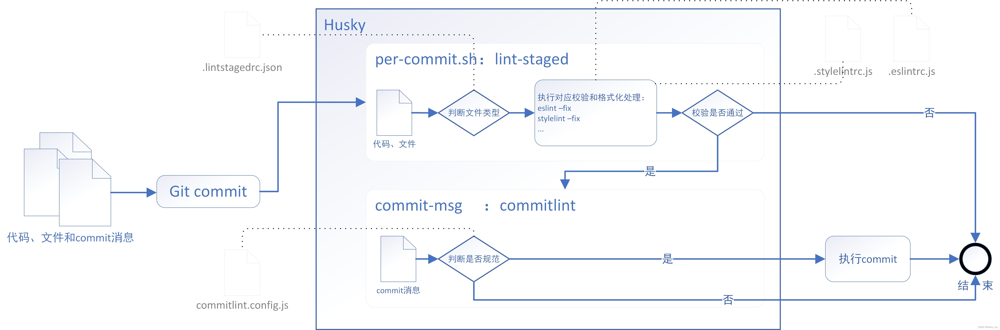

### 前言 —— 前端工程化

前端工程化是一种将前端开发流程系统化、规范化和自动化的方法，旨在提高前端开发的效率、可维护性和可扩展性。它涵盖了许多方面，包括项目结构、代码质量、自动化工具、性能优化等，以确保前端开发团队能够更高效地协作和交付高质量的前端应用程序。

以下是前端工程化的一些关键概念和实践：

-   项目结构：定义清晰的项目目录结构，使开发人员能够轻松查找和组织代码、样式和资源文件。
-   版本控制：使用版本控制系统（如Git）来跟踪和管理代码的变化，以便多个开发人员可以协同工作，并轻松回滚到以前的版本。
-   自动化构建：使用构建工具（如Webpack、Grunt、Gulp等）来自动化任务，如代码编译、压缩、打包和资源优化，以减少手动工作和减小文件大小。
-   模块化开发：采用模块化的代码结构，使开发人员能够更好地管理和复用代码，提高可维护性。
-   包管理器：使用包管理工具（如npm、Yarn）来管理和安装项目依赖，确保开发环境的一致性。
-   代码质量：引入代码风格检查工具（如ESLint、TSLint）和单元测试框架，以确保代码质量和可靠性。
-   自动化部署：使用持续集成/持续部署（CI/CD）工具来自动化应用程序的部署和发布过程，以确保快速且可靠的交付。
-   性能优化：优化前端性能，包括加载时间、资源压缩、懒加载等，以提供更好的用户体验。
-   文档和注释：编写清晰的文档和代码注释，以便其他开发人员能够理解和使用你的代码。

前端工程化的目标是使前端开发更高效、更可靠，并促使开发团队采用一致的最佳实践。它在现代Web开发中变得至关重要，特别是在大型和复杂的项目中，可以显著提高开发团队的生产力和代码质量。

### 【一】 创建项目

```sh
// 1. 创建默认工程
pnpm create vite vite-vue3 --template vue-ts

// 2. 打开目录
cd vite-vue3

// 3. 安装依赖
pnpm install

// 4. 运行项目
npm run dev

```

项目目录结构如下

```
│  ├─public # 静态资源目录
│  │      favicon.ico
│  │
│  ├─src
│  │  │  App.vue # 入口vue文件
│  │  │  main.ts # 入口文件
│  │  │  vite-env.d.ts # vite环境变量声明文件
│  │  │
│  │  ├─assets # 资源文件目录
│  │  │      logo.png
│  │  │
│  │  └─components # 组件文件目录
│  │         HelloWorld.vue
│  │
│  │ .gitignore
│  │ index.html # Vite项目的入口文件
│  │ package.json
│  │ README.md
│  │ tsconfig.json # tsconfig配置文件
│  │ vite.config.ts # vite配置文件
```

### [二]、修改配置

#### 2.1 配置@别名

```ts
import { defineConfig } from 'vite'
import vue from '@vitejs/plugin-vue'
import * as path from 'path'

// https://vitejs.dev/config/
export default defineConfig({
    resolve: {
        //设置别名
        alias: {
            '@': path.resolve(__dirname, 'src'),
        },
    },
    plugins: [vue()],
})
```

-   我们会发现这行代码会报错。 import \* as path from "path"; 找不到模块“path”或其相应的类型声明。ts(2307) 这是因为我们的配置文件是 ts 类型

```sh
// 5. 修复node语法错误
npm install -D @types/node
```

#### 2.2 配置ts语法检查

```json
{
    "compilerOptions": {
        "target": "esnext",
        "useDefineForClassFields": true,
        "module": "esnext",
        "lib": ["esnext", "DOM", "DOM.Iterable"],
        /** 路径别名 */
        "baseUrl": "./",
        "paths": {
            "@": ["src"],
            "@/*": ["src/*"]
        },
        /* Bundler mode */
        "moduleResolution": "node",
        "allowImportingTsExtensions": true,
        "resolveJsonModule": true,
        "isolatedModules": true,
        "noEmit": true,
        "jsx": "preserve",
        "strict": true,
        "noUnusedLocals": false,
        "noUnusedParameters": false,
        "noFallthroughCasesInSwitch": false
    },
    "include": [
        "src/**/*.ts",
        "src/**/*.d.ts",
        "src/**/*.tsx",
        "src/**/*.vue",
        "src/api/xhr/config.js"
    ],
    "references": [
        {
            "path": "./tsconfig.node.json"
        }
    ]
}
```

### 【三】集成router

#### 3.1 安装 vue-router

```sh
pnpm i vue-router@4
```

#### 3.2 使用 vue-router

-   a. 先在 src 目录下创建 router 文件夹，来存放相关的路由文件。

```
│  ├─src
│  │  ├─router # 路由资源文件目录
│  │  │    │  index.ts
│  │  ├─views # 视图文件目录

```

```ts
// src/router/index.ts

import { RouteRecordRaw, createRouter, createWebHistory } from 'vue-router'

const routes: Array<RouteRecordRaw> = [
    { path: '/', redirect: '/home' },

    {
        path: '/home',
        name: 'home',
        component: () => import('@/views/home.vue'),
    },
    {
        path: '/demo',
        name: 'demo',
        component: () => import('@/views/demo.vue'),
    },
]

const router = createRouter({
    // 4. 内部提供了 history 模式的实现。为了简单起见，我们在这里使用 hash 模式。
    history: createWebHistory(),
    routes, // `routes: routes` 的缩写
})

export default router
```

-   b. 新增 home.vue femo.vue,修改APP.vue

```vue
// views/home.vue
<template>
    <div>HOME</div>
</template>

<script setup lang="ts"></script>

// views/demo.vue
<template>
    <div>DEMO</div>
</template>

<script setup lang="ts"></script>

// App.vue
<script setup lang="ts"></script>

<template>
    <RouterView />
</template>

<style scoped>
#app {
    width: 100vw;
    height: 100vh;
}
</style>
```

-   c. 修改 main.ts 文件，引入路由并使用。

```ts
import { createApp } from 'vue'
import App from './App.vue'
import router from './router'

const app = createApp(App)

app.use(router)

app.mount('#app')
```

### [四] 集成pinia

#### 4.1 安装pina

```sh
pnpm i pinia
```

#### 4.2 使用pina

-   a. 与 router 一样，先在 src 目录下创建 store 文件夹，来存放相关的数据状态文件。 目录结构

```
│  ├─src
│  │  ├─store # 数据状态文件目录
│  │  │    ├─ modules
│  │  │    │     │   user.ts
│  │  │    │  index.ts
```

```ts
// store/modules/user.ts
import { defineStore } from 'pinia'

// 第一个参数是应用程序中 store 的唯一 id
const useUserStore = defineStore('user', {
    state: () => {
        return {
            name: 'geek-tim',
        }
    },
})

export default useUserStore
```

-   b. 注册引入使用

```ts
// 在vue中使用pinia
// main.ts

import store from './store'

app.use(store)
```

-   c. 具体页面中使用

```vue
// 使用user数据 // App.vue
<script setup lang="ts">
import useUserStore from '@/store/modules/user'

const userStore = useUserStore()
</script>

<template>
    <div>{{ userStore.name }}</div>
    <RouterView />
</template>

<style scoped>
#app {
    width: 100vw;
    height: 100vh;
}
</style>
```

### [五] 集成 ESLint

#### 5.1 安装 ESLint

```sh
pnpm i eslint --save-dev
pnpm eslint --init

```

```

    "@typescript-eslint/eslint-plugin": "^6.5.0",
    "@typescript-eslint/parser": "^6.5.0",
    "eslint": "^8.48.0",
    "eslint-plugin-vue": "^9.17.0",
```

运行 pnpm eslint --init 后，我们会发现，它给我们安装了一些依赖以及自动创建了文件.eslintrc.json

#### 5.2 新增命令运行检查

```json
{
    "scripts": {
        "lint": "eslint  './src/**/*.{js,jsx,vue,ts,tsx}' --fix"
    }
}
```

使用脚本指令pnpm lint对我们的代码进行校验修复了，如果发现一些异常针对异常进行忽略补充

```json
{
   {
        ignores: ['node_modules/', 'dist/', 'index.html'],
    },
    {
        rules: {
            'vue/multi-word-component-names': 'off',
            '@typescript-eslint/no-explicit-any': 'off',
            '@typescript-eslint/ban-types': [
                'error',
                {
                    extendDefaults: true,
                    types: {
                        '{}': false,
                    },
                },
            ],
        },
    },
}
```

### 5.3 集成 Prettier

```sh
pnpm i prettier eslint-config-prettier eslint-plugin-prettier --save-dev
```

```json
{
    "scripts": {
        "prettier": "prettier --write ."
    }
}
```

### 【六】css集成

方案一：原生 css variable 新特性：
原生支持，不需要第三方插件，具体使用文档可 查看

新建文件 src/styles/index.css

```css
:root {
   --main-bg-color: pink;
 }
 ​
 body {
   background-color: var(--main-bg-color);
 }
```

注：还可以增加 PostCSS 配置，(任何受 postcss-load-config 支持的格式，例如 postcss.config.js )，它将会自动应用于所有已导入的 CSS。

方案二：scss 或 less：

```
// 8. pnpm i less less-loader -D
```

#### 6.1 引入UI样式库

注意：UI 库一般需要按需引入（下面以 element-plus 为例）

a. 安装 vite-plugin-style-import

```
pnpm i vite-plugin-style-import --save-dev
```

b. 修改 vite.config.ts

```ts
import {
  createStyleImportPlugin,
  ElementPlusResolve,
} from 'vite-plugin-style-import'

export default defineConfig({
    ...
    plugins: [
        vue(),
        createStyleImportPlugin({
            resolves:[
                ElementPlusResolve()
            ],
            libs: [
                // 如果没有你需要的resolve，可以在lib内直接写，也可以给我们提供PR
                {
                    libraryName: 'element-plus',
                    esModule: true,
                    resolveStyle: (name) => {
                        return `element-plus/lib/theme-chalk/${name}.css`
                    },
                    ensureStyleFile: true // 忽略文件是否存在, 导入不存在的CSS文件时防止错误。
                },
            ],
        })
    ],
    ...
})
```

### [七] 使用 commitizen 规范git提交

为了使团队多人协作更加的规范，所以需要每次在 git 提交的时候，做一次硬性规范提交，规范 git 的提交信息

#### 7.1 安装 commitizen (交互式提交 + 自定义提示文案 + Commit规范)

a. 安装

```sh
pnpm install -D commitizen cz-conventional-changelog @commitlint/config-conventional @commitlint/cli commitlint-config-cz cz-customizable
```

b. 配置package.json

```json
{
    "scripts": {
        "commit:comment": "引导设置规范化的提交信息",
        "commit": "git-cz"
    },
    "config": {
        "commitizen": {
            "path": "node_modules/cz-customizable"
        }
    }
}
```

c. 新增配置 commitlint.config.js

```ts
export default {
    extends: ['@commitlint/config-conventional', 'cz'],
    rules: {
        'type-enum': [
            2,
            'always',
            [
                'feature', // 新功能（feature）
                'bug', // 此项特别针对bug号，用于向测试反馈bug列表的bug修改情况
                'fix', // 修补bug
                'ui', // 更新 ui
                'docs', // 文档（documentation）
                'style', // 格式（不影响代码运行的变动）
                'perf', // 性能优化
                'release', // 发布
                'deploy', // 部署
                'refactor', // 重构（即不是新增功能，也不是修改bug的代码变动）
                'test', // 增加测试
                'chore', // 构建过程或辅助工具的变动
                'revert', // feat(pencil): add ‘graphiteWidth’ option (撤销之前的commit)
                'merge', // 合并分支， 例如： merge（前端页面）： feature-xxxx修改线程地址
                'build', // 打包
            ],
        ],
        // <type> 格式 小写
        'type-case': [2, 'always', 'lower-case'],
        // <type> 不能为空
        'type-empty': [2, 'never'],
        // <scope> 范围不能为空
        'scope-empty': [2, 'never'],
        // <scope> 范围格式
        'scope-case': [0],
        // <subject> 主要 message 不能为空
        'subject-empty': [2, 'never'],
        // <subject> 以什么为结束标志，禁用
        'subject-full-stop': [0, 'never'],
        // <subject> 格式，禁用
        'subject-case': [0, 'never'],
        // <body> 以空行开头
        'body-leading-blank': [1, 'always'],
        'header-max-length': [0, 'always', 72],
    },
}
```

d. 自定义提示则添加 .cz-config.js

```ts
export default {
    types: [
        { value: 'feature', name: 'feature:  增加新功能' },
        { value: 'bug', name: 'bug:      测试反馈bug列表中的bug号' },
        { value: 'fix', name: 'fix:      修复bug' },
        { value: 'ui', name: 'ui:       更新UI' },
        { value: 'docs', name: 'docs:     文档变更' },
        { value: 'style', name: 'style:    代码格式(不影响代码运行的变动)' },
        { value: 'perf', name: 'perf:     性能优化' },
        {
            value: 'refactor',
            name: 'refactor: 重构(既不是增加feature，也不是修复bug)',
        },
        { value: 'release', name: 'release:  发布' },
        { value: 'deploy', name: 'deploy:   部署' },
        { value: 'test', name: 'test:     增加测试' },
        {
            value: 'chore',
            name: 'chore:    构建过程或辅助工具的变动(更改配置文件)',
        },
        { value: 'revert', name: 'revert:   回退' },
        { value: 'build', name: 'build:    打包' },
    ],
    // override the messages, defaults are as follows
    messages: {
        type: '请选择提交类型:',
        customScope: '请输入您修改的范围(可选):',
        subject: '请简要描述提交 message (必填):',
        body: '请输入详细描述(可选，待优化去除，跳过即可):',
        footer: '请输入要关闭的issue(待优化去除，跳过即可):',
        confirmCommit: '确认使用以上信息提交？(y/n/e/h)',
    },
    allowCustomScopes: true,
    skipQuestions: ['body', 'footer'],
    subjectLimit: 72,
}
```

e. 执行验证

```
npm run commit
```

报错

```
Instead change the require of .cz-config.js in /Users/yutianguo/Documents/outter/demo-mall/coding/vite-vue3/node_modules/.pnpm/find-config@1.0.0/node_modules/find-config/src/find-config.js to a dynamic import() which is available in all CommonJS modules.
```

小问题插曲： 由于package.json 指定了模块为esmodule, git-cz 只支持commonjs规范，则需要使用`.cjs`作为文件类型标识。因此重命名为.cz-config.cjs 文件 和修改package.json

```json
{
    "config": {
        "commitizen": {
            "path": "node_modules/cz-customizable"
        },
        "cz-customizable": {
            "config": "./.cz-config.cjs"
        }
    }
}
```

#### 7.2安装 husky



```
# 1.安装
pnpm i husky lint-staged -D

# 2.生成 .husky 的文件夹 会在 .husky 目录下生成一个 pre-commit 脚本文件
npx husky init

# 3.修改 pre-commit 脚本为
npx --no-install lint-staged

# 4. 使用 `git commit -m "message"` ,如果匹配到对应的js,ts就会看到 hook 生效了。

```

添加配置 package.json

```json
{
  ...
  "lint-staged": {
      "src/**/*.{ts,js,jsx,tsx,vue}": [
            "npm run eslint",
            "npm run prettier"
    	]
  }
  ...
}
```
